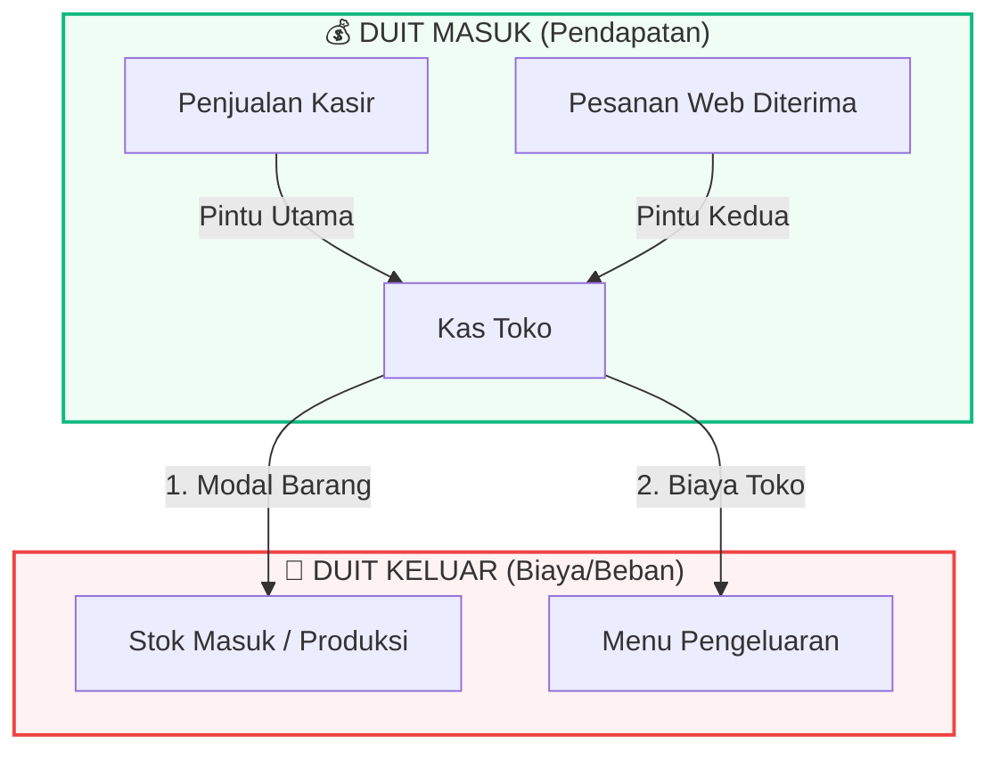

# BUKU PANDUAN SiKasir V3
## Sistem Kasir & Toko Online — Cemilan Mba Tutut
*Versi 3.0 — Juni 2026*

---

## 0. MULAI CEPAT & PETA UANG TOKO

Selamat datang di SiKasir! Aplikasi ini membantu Anda mengelola penjualan kasir, pesanan online dari web, stok barang, produksi, pengeluaran, hingga laporan keuangan dalam satu sistem terpadu.

### 0.1 Cari Bagianmu
Tidak perlu membaca buku ini secara berurutan. Langsung buka bagian yang Anda butuhkan sesuai dengan tugas Anda hari ini:
* **Saya ingin melayani pembeli di kasir** $\rightarrow$ Langsung buka **Bagian 1: Panduan Kasir (Sektor Penjualan)**.
* **Saya pemilik toko/admin yang ingin input barang, stok, promo, dan melihat untung-rugi** $\rightarrow$ Langsung buka **Bagian 2: Panduan Admin (Manajemen Toko)**.
* **Saya ingin mengajari pembeli cara memesan lewat website** $\rightarrow$ Langsung buka **Bagian 3: Toko Online (Sisi Pelanggan)**.
* **Saya mengalami kendala (error, scanner mati, salah input)** $\rightarrow$ Buka **Bagian 5: Penyelesaian Masalah Cepat (FAQ)**.

### 0.2 Cara Membaca Foto Panduan
* Angka di dalam lingkaran oranye (**①, ②, ③**) pada gambar menunjukkan urutan tombol/kotak yang harus Anda tekan atau isi.
* Kata bercetak **tebal** (misal: **Bayar Sekarang**) merujuk pada nama tombol atau label asli yang tertulis di layar komputer/HP.
* Kotak berwarna digunakan untuk memberikan perhatian khusus:
  > 💡 **Tip:** Trik atau cara lebih cepat untuk menyelesaikan tugas.
  > ⚠️ **Peringatan:** Hal penting yang harus diperhatikan agar tidak terjadi kesalahan data.
  > 📝 **Catatan:** Informasi tambahan untuk membantu Anda memahami cara kerja sistem.

---

### 0.3 Peta Uang Toko: Ke Mana Arah Uang Pergi?
Sebelum melayani transaksi atau mencatat keuangan, penting untuk memahami gambaran besar aliran uang di toko. Sistem ini membagi uang menjadi dua arah: **Duit Masuk** dan **Duit Keluar**.

* **Duit Masuk:** Hanya berasal dari **Penjualan Kasir** (langsung maupun pesanan online).
* **Duit Keluar:** Dibagi menjadi 2 macam dan **harus dicatat di tempat yang berbeda**:
  1. **Modal Barang:** Biaya yang menempel pada barang dagangan.
     - Jika barang dibeli jadi dari supplier $\rightarrow$ Catat di **Manajemen Stok $\rightarrow$ Stok Masuk**.
     - Jika barang dibuat sendiri $\rightarrow$ Catat di **Menu Produksi** (sekaligus menghitung modal per biji).
  2. **Biaya Toko:** Biaya operasional untuk menjalankan toko (seperti gaji karyawan, sewa ruko, bayar listrik/air, bensin kurir).
     - Catat di **Menu Pengeluaran**.

> ⚠️ **Aturan Emas Anti Double-Count:**
> Biaya bahan baku martabak atau kemasan plastik dicatat di menu **Produksi** (menempel ke barang). **JANGAN** pernah mencatatnya lagi di menu **Pengeluaran** (biaya toko). Jika dicatat dua kali, laporan laba-rugi toko Anda akan salah dan toko terlihat seolah-olah rugi.

---

## 1. PANDUAN KASIR (SEKTOR PENJUALAN)

Bagian ini ditulis khusus untuk staf kasir yang melayani pembeli setiap hari.

### 1.1 Layar Utama Transaksi (Kasir / POS)
Layar ini adalah "senjata utama" kasir. Terdiri dari daftar produk di sebelah kiri dan keranjang belanja di sebelah kanan.

*Gambar 1.1 — Antarmuka Layar Transaksi Kasir*

**Keterangan Nomor Layar:**
1. **Kotak Pencarian:** Tempat mengetik nama produk untuk menyaring daftar dengan cepat.
2. **Status Barcode Scanner:** Pil bertuliskan *"Scanner siap"* menandakan alat pemindai barcode aktif dan siap digunakan.
3. **Menu Layanan/Jasa (Ungu):** Halaman khusus untuk transaksi non-barang seperti transfer bank dan tarik tunai.
4. **Kategori Produk:** Tombol cepat untuk memfilter barang berdasarkan golongannya (misal: Frozen Food, Minuman).
5. **Chip Sering Dibeli:** Daftar barang terlaris tanpa barcode (seperti permen eceran). Tinggal ketuk chip ini untuk memasukkannya ke keranjang.
6. **Kartu Produk:** Menampilkan foto, nama barang, harga, dan sisa stok fisik di sistem.
7. **Keranjang Belanja:** Daftar belanjaan pembeli saat ini.

---

### 1.2 Cara Melayani Penjualan Barang Eceran (Satuan)
Skenario harian jika pembeli membawa keripik, cemilan, atau minuman botol ke meja kasir.

1. Buka menu **Transaksi** di menu sebelah kiri.
2. Masukkan barang ke keranjang dengan salah satu cara berikut:
   - **Gunakan Scanner:** Arahkan barcode produk ke scanner. Barang otomatis masuk keranjang.
   - **Gunakan Pencarian:** Ketik nama produk di kotak pencarian, lalu ketuk **Kartu Produk**.
   - **Gunakan Chip Sering Dibeli:** Ketuk chip nama barang (misal: "Permen") di baris atas.
3. Atur jumlah pembelian menggunakan tombol **–** atau **+** di dalam keranjang belanja.
4. Periksa **Total Belanja** di bagian bawah keranjang.
5. Pilih **Metode Pembayaran**: **Tunai**, **QRIS**, atau **Transfer**.
6. **Untuk Pembayaran Tunai:** Isi jumlah uang yang diberikan pembeli di kolom **Uang Diterima**, atau tekan tombol nominal cepat (misal: Uang Pas, Rp50.000, Rp100.000).
7. Lihat jumlah **Kembalian** pada kotak hijau yang muncul otomatis.
8. Tekan **Bayar Sekarang**. Transaksi selesai, stok terpotong, dan Anda bisa menekan tombol **Cetak Struk**.

---

### 1.3 Cara Melayani Penjualan Barang Timbangan/Bensin (Curah)
Skenario jika pembeli membeli bawang per kilogram atau bensin per liter dengan menyebut nominal uang (rupiah).

1. Ketuk kartu produk curah (misal: **Bensin Pertalite** atau **Bawang Merah**).
2. Di dalam keranjang belanja, Anda akan melihat input khusus nominal Rupiah.
3. Ketik nominal uang pembelian yang diminta pembeli. 
   - *Contoh:* Pembeli membeli bensin *"Isi Rp20.000, Kak"*. Ketik **20000** di kolom Rupiah.
4. Sistem otomatis menghitung jumlah liter/kg yang didapat dan menampilkannya dengan tanda gelombang (misal: `≈ 1.667 liter` jika harga per liter Rp12.000).
5. Nilai subtotal baris tersebut akan bernilai **persis Rp20.000** (tidak dibulatkan).
6. Selesaikan transaksi dengan memilih metode pembayaran dan menekan **Bayar Sekarang**.

---

### 1.4 Cara Melayani Layanan/Jasa (Transfer Bank & Tarik Tunai)
Skenario jika ada pelanggan yang datang untuk mengirim uang atau mengambil uang tunai lewat rekening bank agen Anda.

> 📝 **Catatan:** Transaksi Jasa dilakukan di halaman **Transaksi** utama, menggunakan baris khusus berwarna ungu bernama **Layanan** (di bawah kolom pencarian).

1. Buka menu **Transaksi** di sidebar kiri.
2. Pada band ungu bertuliskan **Layanan**, ketuk tombol jenis jasa yang diinginkan pelanggan (misal: **Transfer BRI** atau **Tarik Tunai Mandiri**).
3. Jasa tersebut akan masuk ke keranjang belanja sebelah kanan dengan warna ungu.
4. Pada baris jasa di keranjang belanja, isi dua kolom wajib:
   - **Nominal (titipan):** Jumlah uang pokok yang ditransfer/ditarik (misal: ketik `500000` untuk transfer Rp500.000).
   - **Fee:** Ongkos kirim/jasa yang ditentukan toko (fee akan otomatis terisi jika admin sudah mengatur tarif bertingkat, atau diketik manual jika tidak ada tarif bawaan).
5. Nilai subtotal baris jasa tersebut adalah senilai **Fee saja** (omzet toko), namun **Total Tagihan** di bagian bawah keranjang otomatis menambahkan nominal titipan (misal: Total Tagihan = Rp5.000 fee + Rp500.000 titipan = Rp505.000).
6. Selesaikan transaksi pembayaran seperti biasa (biasanya pembeli membayar tunai sebesar Rp505.000).
7. Tekan **Bayar Sekarang**.
   - *Catatan Akuntansi:* Sistem mencatat omzet toko Anda sebesar **Rp5.000 (hanya Fee)**. Nominal pokok Rp500.000 tidak dihitung sebagai omzet/laba kotor karena uang tersebut langsung dikirim keluar dari saldo bank agen Anda.

---

### 1.5 Cara Menyimpan Pesanan & Memproses Pesanan Online

#### A. Menyimpan Pesanan (Bayar Nanti)
Gunakan ini jika pembeli meletakkan barang di meja kasir tetapi ingin mengambil barang lain dulu, atau ingin membayar nanti saat hendak pulang.

1. Masukkan barang belanjaan pembeli ke keranjang seperti biasa. Fitur ini hanya untuk produk **satuan/eceran** — barang **curah** dan **jasa** tidak bisa disimpan sebagai pesanan.
2. Di bagian atas ringkasan keranjang ada dua pilihan: **Proses Sekarang** dan **Simpan Pesanan**. Tekan **Simpan Pesanan** (kotaknya berubah jadi oranye).
3. Isi **Nama pemesan** dan **Nomor WhatsApp** (boleh tambah **Catatan** bila perlu), lalu tekan tombol oranye **Simpan sebagai Pesanan** di paling bawah.
4. Stok barang otomatis ditahan agar tidak terjual ke orang lain. Pesanan pindah ke menu **Pesanan Online** dengan status *Menunggu*, siap dibayar saat pembeli kembali.

#### B. Memproses Pesanan Online (Saat Diambil/Dibayar)
Gunakan ini saat pelanggan datang ke toko untuk mengambil pesanan yang mereka buat dari website toko online atau pesanan yang Anda simpan sebelumnya.

*Gambar 1.5 — Jendela Proses Pembayaran: ① pilih Metode Bayar · ② isi Uang Diterima · ③ tekan Selesaikan Pembayaran.*

1. Buka menu **Pesanan Online** di sidebar kiri. Semua pesanan yang belum dibayar berkumpul di bagian **Perlu Diproses**.
2. Cari pelanggan lewat kotak pencarian di atas — pencarian mencocokkan **nama pemesan atau nomor WhatsApp** (bukan kode pesanan).
3. Jika barang sudah selesai dibungkus, tekan **Tandai Siap**; status pesanan berubah jadi *Siap diambil* dan tombolnya berganti menjadi **Ingatkan via WA** untuk mengabari pelanggan. *(Langkah ini opsional — boleh langsung ke pembayaran.)*
4. Ketika pelanggan membayar, tekan tombol biru **Proses Bayar** (berikon dompet). Jendela **Proses Pembayaran** akan terbuka.
5. Di jendela tersebut: ① pilih **Metode Bayar** (Tunai / QRIS / Transfer), ② isi **Uang Diterima** — atau tekan **Uang pas** untuk mengisinya otomatis sejumlah total — lalu ③ tekan **Selesaikan Pembayaran**.
6. Pesanan selesai dan tercatat resmi sebagai transaksi penjualan. Riwayatnya pindah ke bagian **Riwayat Pesanan**, lengkap dengan tombol **Kirim Struk** via WhatsApp.

> 📝 Untuk **QRIS** dan **Transfer**, kolom Uang Diterima otomatis terisi sebesar total tagihan, jadi Anda tinggal menekan Selesaikan Pembayaran.

---

### 1.6 Tutup Laci & Cetak Laporan Sesi Kasir
Lakukan ini di akhir giliran kerja (shift) Anda untuk menyerahkan uang laci kasir kepada pemilik toko.

1. Buka menu **Riwayat Transaksi** di sebelah kiri.
2. Atur **Periode** filter ke *Hari Ini*.
3. Periksa ringkasan uang masuk yang terbagi berdasarkan metode:
   - Total Tunai (cash di laci).
   - Total QRIS.
   - Total Transfer Bank.
4. Hitung uang fisik di laci kasir Anda, pastikan jumlahnya pas dengan angka **Total Tunai** di layar.
5. Tekan tombol **Cetak Laporan Sesi** di kanan atas. Printer struk akan mencetak rekap omzet shift Anda untuk diserahkan ke pemilik toko bersama dengan uang fisiknya.

---

## 2. PANDUAN ADMIN (MANAJEMEN TOKO)

Bagian ini ditulis untuk Pemilik Toko (Admin) untuk mengelola data master, operasional harian, dan membaca laporan keuangan.

### 2.1 Menyiapkan Data Master (Kategori & Produk)

#### A. Cara Menambah Kategori
Kategori berguna agar barang tersusun rapi di kasir dan website.
1. Buka menu **Kategori** $\rightarrow$ Tekan **Tambah Kategori Baru** di kanan atas.
2. Ketik nama kategori (misal: *Cemilan Kering*, *Frozen Food*), lalu simpan.

#### B. Cara Menambah Produk Baru
Mendaftarkan barang dagangan baru agar kasir bisa memindai barcodenya.

*Gambar 2.1 — Pengisian Form Produk Bagian Atas*

1. Buka menu **Data Produk** $\rightarrow$ Tekan **Tambah Produk Baru**.
2. **Informasi Produk:** Isi nama produk, pilih **Kategori** ②.
3. **Jenis & Cara Jual:**
   - **Asal Produk:** Pilih **Beli Jadi** (barang kulakan) atau **Buatan Sendiri** (olahan dapur Anda).
   - **Tipe Jual:** Pilih **Satuan** (eceran per biji), **Curah** (timbangan/literan), atau **Jasa** (transfer/tarik tunai).
4. **Harga & Stok** (kolomnya menyesuaikan pilihan di atas):
   - Isi **Harga Jual**.
   - Jika Asal Produk = **Beli Jadi**, isi juga **Harga Modal/Beli** dan **Stok Awal** di form ini.
   - Jika Asal Produk = **Buatan Sendiri**, kolom **Harga Modal** dan **Stok** **tidak muncul** — keduanya dihitung otomatis dari menu **Produksi**. Setelah produk tersimpan, aplikasi menawarkan langsung membuka menu Produksi untuk mencatat batch pertamanya.
   - Jika Tipe Jual = **Jasa**, bagian Harga & Stok diganti **Tarif Fee Bertingkat** (atur fee/biaya admin per rentang nominal; pendapatan toko = fee-nya).
5. **Barcode & SKU:**
   - Sorot kursor ke kolom Barcode, lalu tembakkan barcode fisik barang dengan scanner agar kodenya terinput otomatis.
   - Jika barang tidak memiliki barcode fisik, tekan tombol **Generate Otomatis** agar sistem membuatkan kode barcode internal.
6. Tekan **Tambah Produk** untuk menyimpan.

> ⚠️ **PERINGATAN KERAS:**
> Jika suatu produk tidak lagi dijual, **JANGAN DIHAPUS**. Menghapus produk akan membuat transaksi masa lalu yang mencatat produk tersebut menjadi rusak atau hilang dari laporan laba rugi. Gunakan aksi **Arsipkan** agar produk hilang dari kasir namun data keuangannya tetap tersimpan rapi.

---

### 2.2 Mengatur Duit Keluar (Stok Masuk vs Produksi vs Pengeluaran)

Cara menginput uang keluar tergantung dari untuk apa uang tersebut digunakan:

#### A. Kulakan Barang Jadi (Stok Masuk)
Gunakan ini untuk menambah stok barang kulakan yang dibeli dari supplier.
1. Buka menu **Manajemen Stok** $\rightarrow$ Klik tombol **Stok Masuk** ①.
2. Cari nama produk, isi **Jumlah Masuk** (misal: 100 bungkus) dan **Harga Beli Baru** jika harga kulakan dari supplier naik/turun.
3. Simpan. Stok produk otomatis bertambah dan harga modal produk dihitung rata-rata oleh sistem.

#### B. Membuat Barang Sendiri (Produksi)
Gunakan ini untuk menambah stok keripik atau kue olahan dapur Anda sendiri sekaligus menghitung harga modal per unitnya.

*Gambar 2.2 — Form Pencatatan Batch Produksi*

1. Buka menu **Produksi** $\rightarrow$ Tekan **Catat Produksi**.
2. Pilih produk buatan sendiri.
3. Isi **Jumlah Hasil** (berapa bungkus keripik yang berhasil dibuat hari ini) ③.
4. Pilih **Mode Biaya**:
   - **Sederhana (Total):** Cukup isi satu angka total modal belanja dapur hari ini (misal: habis Rp100.000 untuk minyak, singkong, bumbu).
   - **Rincian:** Isi biaya per komponen jika ingin mencatat rincian detail bahan.
5. Periksa kolom **Modal / Unit** yang terhitung otomatis di bawahnya (misal: total biaya Rp100.000 dibagi 50 bungkus hasil = Rp2.000 modal per bungkus).
6. Tekan **Simpan Produksi**. Langkah ini otomatis menambah stok barang di kasir dan meng-update harga modal produk agar perhitungan untung-rugi akurat.

#### C. Bayar Biaya Operasional Toko (Pengeluaran)
Gunakan ini untuk mencatat uang keluar yang **bukan untuk belanja barang dagangan**.
1. Buka menu **Pengeluaran** $\rightarrow$ Tekan **Tambah Pengeluaran**.
2. Pilih **Tipe Pengeluaran** (misal: *Gaji Staf*, *Sewa Ruko*, *Listrik & Air*, *Peralatan Toko*).
3. Isi **Judul** (misal: *"Bayar listrik bulan Juni"*) dan **Nominal** uang keluar.
4. Tekan **Simpan Pengeluaran**.

---

### 2.3 Mengatur Reseller & Pelanggan
1. Buka menu **Pelanggan** $\rightarrow$ Tekan **Tambah Pelanggan**.
2. Isi nama pelanggan, nomor telepon, dan pilih Tipe: **Reseller**.
3. Buka menu **Data Produk** $\rightarrow$ Edit produk yang ingin diberikan diskon reseller $\rightarrow$ Isi nominal pada kolom **Potongan Reseller (Rp)** (misal: isi 1500 agar reseller mendapat potongan Rp1.500 dari harga jual biasa).
4. Saat kasir bertransaksi, kasir cukup memilih nama pelanggan reseller tersebut di dropdown keranjang, dan seluruh harga belanjaan reseller otomatis terpotong.

---

### 2.4 Membuat Promo / Diskon
1. Buka menu **Promo** $\rightarrow$ Tekan **Tambah Promo Baru** ①.
2. Isi Nama Promo (misal: *"Promo Gajian"*), lalu pilih **Tipe Diskon**: **Nominal (Rp)** — potongan rupiah, atau **Bundling (beli X gratis Y)** — isi jumlah beli & jumlah gratis. (Tipe Persentase lama tidak bisa dipilih lagi untuk promo baru.)
3. Tentukan sasaran produk: **Semua Produk** atau **Produk Spesifik** saja.
4. Jika memilih produk spesifik, perhatikan widget **Dampak ke Laba per Unit** di bawah form:
   - **Warna Hijau:** Diskon aman, Anda masih mendapatkan untung bersih yang layak.
   - **Warna Kuning:** Untung sangat tipis (margin mepet).
   - **Warna Merah:** Rugi! Diskon yang Anda berikan melebihi selisih harga jual dan harga modal. Anda harus memperkecil diskon atau membatalkannya.
5. Tentukan tanggal berlaku, centang **Promo ini aktif**, lalu simpan.

---

### 2.5 Membaca Dashboard & Laporan Keuangan (Laba-Rugi)

#### A. Dashboard Admin: Membaca "Perlu Perhatian"
Saat membuka dashboard admin, lihat kotak **Perlu Perhatian** di bagian atas. Kotak ini memberikan peringatan otomatis jika ada stok barang fast-moving yang menipis atau habis, sehingga Anda bisa langsung kulakan tanpa perlu mengecek rak satu per satu.

#### B. Dashboard Admin: Rekomendasi Promo Barang "Jarang Laku"
Di dashboard admin juga terdapat daftar **Produk Jarang Laku** (barang yang masih punya stok fisik tetapi penjualannya bernilai nol atau sangat sedikit dalam **30 hari terakhir**). 
* Gunakan tombol **Buat Promo** di sebelah kanan nama barang tersebut untuk langsung membuat diskon diskon cuci gudang agar modal toko Anda tidak mati di barang tidak laku.

#### C. Laporan Keuangan: Tab Laba Rugi
Menampilkan berapa omzet kotor, total modal barang, biaya operasional, dan **Laba Bersih** (keuntungan bersih toko setelah dikurangi semua modal dan biaya).

> ⚠️ **Peringatan "Rugi Semu" di Awal Bulan:**
> Jika Anda menyaring laporan keuangan dengan periode yang sangat pendek (misal: tanggal 1 sampai tanggal 3 awal bulan), laba bersih toko Anda bisa saja terlihat minus (merah/rugi). Hal ini wajar karena biaya sewa ruko atau gaji bulanan sudah dicatat penuh di awal bulan sedangkan penjualan baru berjalan beberapa hari. Untuk penilaian untung-rugi yang adil, pilihlah filter periode **Satu Bulan Penuh** atau **Satu Tahun**.

#### D. Laporan Keuangan: Tab Rekonsiliasi Pembayaran
Gunakan tab ini di sore hari untuk memastikan seluruh pembayaran nontunai (QRIS & Transfer) dari pembeli benar-benar sudah masuk ke rekening bank / e-wallet toko Anda. Rekonsiliasi mencocokkan laporan kasir dengan mutasi bank Anda secara real-time.

---

## 3. TOKO ONLINE (SISI PELANGGAN)

Website toko online Anda dapat diakses oleh pelanggan publik tanpa perlu login.

### 3.1 Cara Pelanggan Membuat Pesanan Web

*Gambar 3.1 — Keranjang Belanja Toko Online Pelanggan*

1. Pelanggan membuka alamat website toko online Anda lewat HP/Komputer.
2. Pelanggan memilih produk dari katalog dan menekan tombol **+** untuk memasukkannya ke keranjang belanja ①.
3. Pelanggan membuka ikon Keranjang belanja di pojok kanan atas, lalu menekan tombol **Lanjut ke Pemesanan** ②.
4. Pelanggan mengisi form data pemesan: **Nama**, **Nomor WhatsApp**, dan **Catatan Tambahan** (misal: *"Ambil jam 5 sore"*).
5. Pelanggan menekan tombol hijau **Buat Pesanan & Kirim WA**.
   - Sistem otomatis menyimpan pesanan di menu kasir Anda dan mengunci stoknya agar tidak dibeli orang lain.
   - Layar HP pelanggan akan otomatis membuka aplikasi WhatsApp untuk mengirim chat pesanan ke nomor toko Anda.

#### Format Pesanan WhatsApp Otomatis:
> *Halo Cemilan Mba Tutut, saya ingin memesan:*
> *- 2x Makaroni Pedas (Rp20.000)*
> *- 1x Kripik Kaca (Rp15.000)*
> *Total: Rp35.000*
> *Nama: Budi*
> *Catatan: Ambil jam 5 sore*

---

### 3.2 Cara Pelanggan Melacak Pesanan
Pelanggan dapat memantau status buatannya sendiri tanpa perlu chat admin toko.
1. Pelanggan membuka menu **Lacak Pesanan** di bagian atas website.
2. Ketik nomor WhatsApp yang digunakan saat memesan, lalu tekan **Lacak**.
3. Status pesanan akan muncul:
   - **Menunggu Diproses:** Pesanan sudah masuk sistem toko.
   - **Siap Diambil:** Barang sudah dibungkus oleh kasir dan siap diambil ke toko.
   - **Selesai:** Barang sudah diambil dan lunas dibayar.
   - **Dibatalkan:** Pesanan dibatalkan oleh pihak toko (stok otomatis dikembalikan ke rak).

---

## 4. LAMPIRAN (PENGATURAN AKUN STAF)

Setiap staf (Kasir maupun Admin) dapat mengatur akun masing-masing dengan menekan **Nama Akun** di pojok kiri bawah layar, lalu memilih menu **Settings**.

### 4.1 Mengubah Nama & Email (Profile)
1. Buka tab **Profile**.
2. Ubah kolom **Name** (Nama lengkap Anda) dan **Email Address** (Email untuk login).
3. Tekan tombol **Save**.

### 4.2 Mengganti Kata Sandi Akun (Security)
Keamanan akun sangat penting agar tidak ada orang lain yang menyalahgunakan laci kasir Anda.
1. Buka tab **Security**.
2. Isi **Current Password** dengan sandi lama Anda saat ini.
3. Isi **New Password** dengan sandi baru Anda yang aman.
4. Isi **Confirm Password** dengan mengulangi sandi baru tersebut sama persis.
5. Tekan **Save**.

### 4.3 Mengubah Warna Layar (Appearance)
Pilih tema tampilan yang paling nyaman untuk mata Anda:
* **Light:** Tema terang latar putih (disarankan untuk siang hari).
* **Dark:** Tema gelap latar hitam (nyaman untuk malam hari agar mata tidak cepat lelah).
* **System:** Mengikuti pengaturan terang-gelap otomatis dari HP/komputer Anda.

---

## 5. PENYELESAIAN MASALAH CEPAT (FAQ)

### Tanya: "Kenapa barcode produk tidak mau terbaca saat ditembak scanner?"
* **Jawab:** Pastikan kabel scanner terhubung erat ke komputer/HP dan lampu scanner menyala. Jika barcode fisik produk sudah rusak/kotor, kasir dapat menginput barang dengan mengetik nama barang secara manual di kolom **Cari Produk**.

### Tanya: "Kasir salah menginput jumlah uang yang diterima pembeli (misal: belanja Rp15.000, uang diterima Rp50.000, tapi terketik Rp500.000). Apa yang harus dilakukan?"
* **Jawab:** Uang kembalian yang muncul di layar akan menjadi salah. Namun Anda tidak perlu panik. Selesaikan saja pembayaran, lalu berikan uang kembalian fisik yang benar kepada pembeli (Rp35.000). Kesalahan ketik ini tidak memengaruhi jumlah uang asli di laci Anda, hanya catatan sistem saja. Jika Admin ingin merapikan laporan, Admin dapat masuk ke menu **Data Transaksi**, menghapus transaksi salah tersebut, lalu kasir menginput ulang transaksi yang benar.

### Tanya: "Pembeli membatalkan pembelian satu barang ketika barang tersebut sudah masuk ke keranjang belanja kasir. Bagaimana menghapusnya?"
* **Jawab:** Ketuk ikon tempat sampah kecil berwarna merah di sebelah kanan nama barang tersebut di dalam daftar keranjang belanja. Barang akan langsung terhapus dan nilai total belanjaan berkurang otomatis. Jika ingin membatalkan seluruh isi keranjang sekaligus, tekan tombol merah **Kosongkan** di bagian atas keranjang.

### Tanya: "Status pesanan online pembeli tertulis 'Dibatalkan'. Mengapa dan ke mana stok barangnya?"
* **Jawab:** Pesanan dibatalkan biasanya karena pembeli tidak kunjung datang ke toko setelah batas waktu tertentu. Saat admin/kasir menekan tombol **Batalkan Pesanan**, sistem otomatis mengembalikan stok barang tersebut ke rak jualan di halaman kasir secara real-time. Tidak ada stok yang hilang atau macet.

### Tanya: "Kenapa printer struk tidak mencetak kertas struk setelah pembayaran selesai?"
* **Jawab:** 
  1. Pastikan printer struk dalam kondisi menyala (lampu indikator menyala hijau) dan kabel USB tersambung.
  2. Periksa apakah kertas struk di dalam printer habis atau terbalik pemasangannya.
  3. Jika masih tidak mencetak, Anda selalu dapat mencetak ulang struk lama dengan membuka menu **Riwayat Transaksi**, mencari transaksi yang dimaksud, lalu menekan ikon **Printer** pada baris transaksi tersebut.
